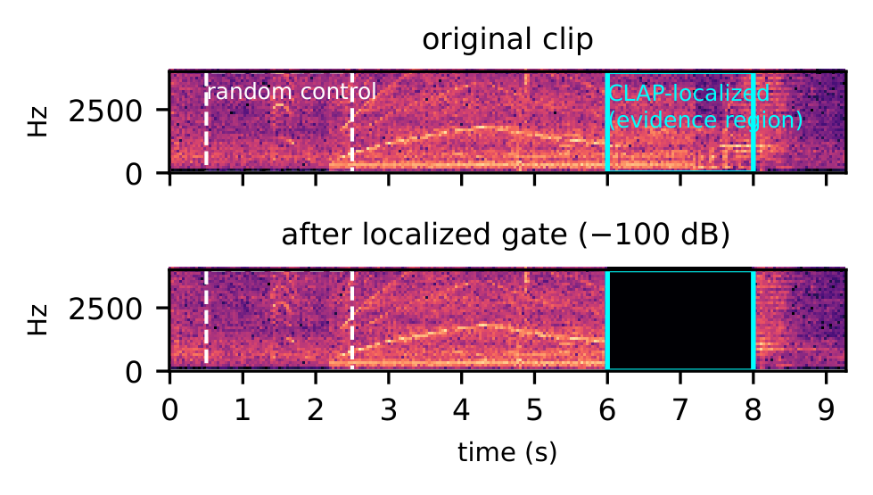
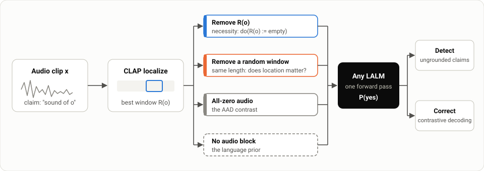
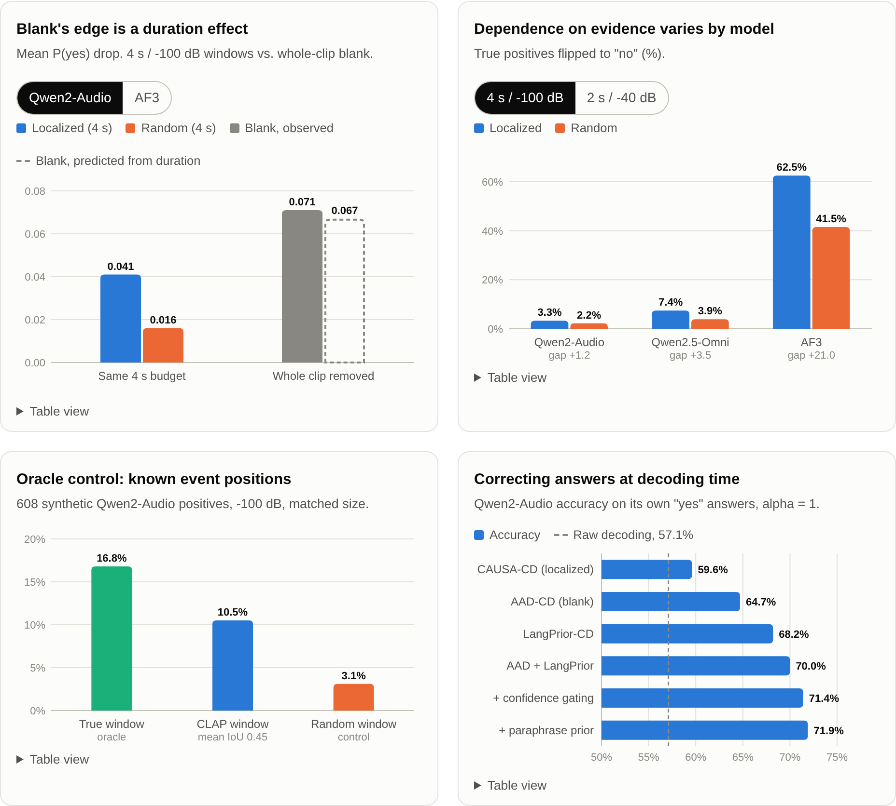
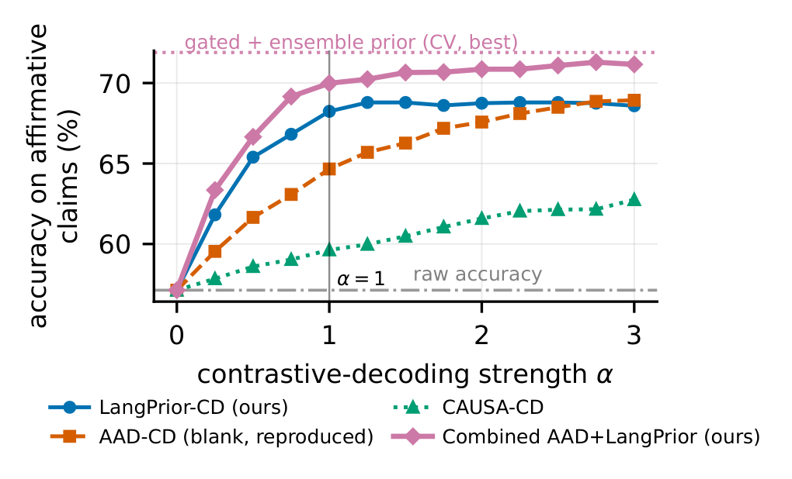

<div align="center">

# Does Location Matter?

### A Black-Box Causal Audit Reveals Model-Dependent Audio Grounding in LALM Hallucination

[Mohammad Khalooei](https://github.com/khalooei)<sup>1</sup>, Mohammad Sabokrou<sup>2,3</sup>

<sup>1</sup>Sharif University of Technology, <sup>2</sup>New Uzbekistan University, <sup>3</sup>Okinawa Institute of Science and Technology

[](https://khalooei.github.io/CAUSA/)
[](paper/main.pdf)
[](#citation)
[](LICENSE)

<b>A black-box, training-free causal test of whether audio-language models ground their answers in the audio: remove only the evidence a claim relies on, and see whether the model changes its mind.</b>

Project page: <a href="https://khalooei.github.io/CAUSA/">khalooei.github.io/CAUSA</a>



<em>A correct "laughter" claim from Qwen2-Audio. Removing the CLAP-localized window (cyan)
drops P(yes) from 0.905 to 0.133 and flips the answer; removing a random window of the
same length (white, dashed) does not.</em>

</div>

## News

- **2026-10**: Code, reproduction scripts and the [project page](https://khalooei.github.io/CAUSA/) are released.
- **2026-09**: Paper submitted to ICASSP 2027.

## Overview

Large audio-language models (LALMs) often say a sound is present when it is
not. Audio-Aware Decoding (AAD), the usual inference-time fix, contrasts the
model's answer on the real clip with its answer on an all-zero waveform.
Silence is out-of-distribution for the audio encoder, though, so this
contrast confounds "the evidence is absent" with "the input is malformed".

**CAUSA** (Causal Audio Grounding via Ablation) removes only the part of the
recording a claim should rely on, keeps the rest of the clip intact, and asks
whether the model changes its answer, and whether it changes it more than
when an equally long random part is removed. The test needs only waveforms in
and yes/no probabilities out, so it applies to any LALM without training or
access to model internals.

<p align="center">
  
</p>

## Highlights

- Localized ablation has a lower raw AUROC than blank audio on Qwen2-Audio
  (0.613 vs. 0.721, n = 4355), but this is a duration effect: blank removes
  the whole ~10 s clip and our windows remove 2-4 s. A regression on the
  removed fraction, fitted on random windows only, predicts blank's mean
  effect almost exactly (0.067 vs. 0.071).
- At matched duration, removing the CLAP window beats removing a random
  window in every grid cell, for both Qwen2-Audio and Audio Flamingo 3
  (4 s / -100 dB: paired Wilcoxon p = 4.8e-46 and 5.7e-43).
- The size of the effect depends on the model. AF3 flips 62.5% of its true
  positives under localized removal vs. 41.5% under random removal;
  Qwen2-Audio and Qwen2.5-Omni flip only a few percent. A synthetic oracle
  with known event positions shows this is partly CLAP localization error
  and partly real location-insensitivity.
- For decoding, contrasting with the language-only prior raises
  Qwen2-Audio's accuracy from 57.1% to 68.2% at alpha = 1 (AAD: 64.7%).
  Combining it with AAD and gating by prior confidence gives 71.9%
  (cross-validated).
- A detector trained on one model's causal signals does not transfer to the
  other model. Qwen2.5-Omni behaves like Qwen2-Audio, not like AF3.

## Method

For a claim "yes, there is a sound of `o`" about a clip:

1. **Localize.** Slide a 2 s or 4 s window (0.5 s hop) over the clip, score
   each window against the text "a sound of `o`" with LAION-CLAP, and take
   the best window `R(o)`.
2. **Necessity.** Attenuate `R(o)` by -40 or -100 dB (STFT masking with
   50 ms raised-cosine edges) and ask again.
3. **Controls.** Repeat the removal on a random window of the same size,
   on an all-zero clip (the AAD contrast), and with no audio block at all
   (the language prior).
4. **Sufficiency.** Mix a real exemplar of `o` into a clip the model
   correctly rejects and check that the answer flips to "yes".

Every condition is scored identically: a single deterministic forward pass,
reading the next-token probabilities of "yes" and "no".

For a graded version of the test, we remove the top-ranked windows one
after another and record the minimal necessary removal fraction
`R* = inf{ r : C(do(R_r)) = no }`. Its expectation equals the area under the
deletion curve, which turns the familiar deletion metric into the mean of a
latent counterfactual. Running the same search in random order gives the
localization efficiency `Delta_loc = E[R*_rand - R*_clap]`.

For decoding, each contrast `c` corrects the answer through
`d = (1+alpha)*logit(p_real) - alpha*logit(p_c)` (answer "yes" iff `d > 0`). The
combined rule adds the blank and language-prior contrasts. The prior's
weight is scaled per example by its own confidence `p_lang`.

## Results

Explore every result interactively, and try the intervention on your own
audio in the browser, on the [project page](https://khalooei.github.io/CAUSA/).

<p align="center">
  <a href="https://khalooei.github.io/CAUSA/"></a>
</p>


Hallucination detection, Qwen2-Audio-7B-Instruct (n = 4355; 1867 hallucinated)

| Method | AUROC |
|---|:---:|
| CAUSA causal grounding ensemble (5 signals) | 0.743 |
| AAD blank-audio ablation | 0.721 |
| CAUSA localized, 4 s / -100 dB | 0.613 |
| Random-window control, 4 s / -100 dB | 0.577 |

Necessity flip rate on true positives, localized vs. random window

| Model | Setting | Localized | Random | Gap |
|---|---|:---:|:---:|:---:|
| Qwen2-Audio | 4 s / -100 dB | 3.3% | 2.2% | +1.2 |
| Qwen2.5-Omni | 4 s / -100 dB | 7.4% | 3.9% | +3.5 |
| Audio Flamingo 3 | 4 s / -100 dB | 62.5% | 41.5% | +21.0 |

Oracle-localization control (608 synthetic Qwen2-Audio positives with known event position)

| Ablated window | Oracle | CLAP | Random |
|---|:---:|:---:|:---:|
| Flip rate | 16.8% | 10.5% | 3.1% |
| Mean P(yes) drop | 0.126 | 0.079 | 0.016 |

Mean CLAP-to-true-window IoU: 0.45 (25% with no overlap).

Contrastive decoding, accuracy on Qwen2-Audio's affirmative claims (raw: 57.1%)

| Contrast (alpha = 1) | Accuracy |
|---|:---:|
| CAUSA-CD (localized) | 59.6% |
| AAD-CD (blank) | 64.7% |
| LangPrior-CD | 68.2% |
| AAD + LangPrior | 70.0% |
| + confidence gating | 71.4% |
| + paraphrase-ensembled prior | 71.9% |



Audio Flamingo 3 is already at 93.0% precision on its own "yes" answers,
and its language prior is near zero. No contrast improves it.

## Installation

```bash
git clone https://github.com/khalooei/CAUSA.git
cd CAUSA
python -m venv .venv && source .venv/bin/activate
pip install -e .            # or: pip install -r requirements.txt
```

A CUDA GPU with 32 GB of memory runs every model in this repository; one
model is loaded at a time. Weights download from the Hugging Face Hub on
first use.

Check the installation without a GPU or any model download:

```bash
pip install pytest && pytest -q
```

## Single-clip demo

Audit one claim end to end on any audio file:

```bash
python examples/necessity_demo.py --audio path/to/clip.wav --object laughter \
    --model qwen2audio --save-dir demo_out
```

The demo prints P(yes) and the yes/no answer under each condition: the
original clip, the CLAP-localized removal, a random window of the same size,
blank audio, and no audio. It then prints the localized-minus-random drop
(positive when the located region matters more than an arbitrary one), how
far the audio moves P(yes) beyond the language prior, and the answers of the
three contrastive-decoding rules at alpha = 1.

`--model` accepts `qwen2audio`, `af3` or `qwen25omni`. With `--save-dir`,
the original, localized-ablated and random-ablated waveforms are written
out so you can listen to the intervention.

## Using CAUSA as a library

```python
from causa.ablation import random_window, spectral_gate_remove
from causa.clap_localizer import SAMPLE_RATE as CLAP_SR, ClapLocalizer
from causa.data import load_audio
from causa.lalm import Qwen2AudioLALM

lalm, clap = Qwen2AudioLALM(), ClapLocalizer()
audio = load_audio("clip.wav", sr=16000)

loc = clap.localize(load_audio("clip.wav", sr=CLAP_SR), CLAP_SR, "laughter", window_sec=4.0)
gated = spectral_gate_remove(audio, 16000, loc.t_start, loc.t_end, attenuation_db=-100.0)

before = lalm.score_yes_no(audio, "laughter")   # YesNoScore(p_yes, p_no, logit_yes, logit_no)
after = lalm.score_yes_no(gated, "laughter")
prior = lalm.score_yes_no(None, "laughter")     # language-only: no audio block at all
print(before.p_yes, after.p_yes, after.claim, prior.p_yes)
```

All three model wrappers (`causa.lalm.Qwen2AudioLALM`,
`causa.af3_lalm.AudioFlamingo3LALM`, `causa.qwen25omni_lalm.Qwen25OmniLALM`)
expose the same `score_yes_no` interface. Adding another LALM only requires
implementing that one method.

## Reproducing the paper

```bash
bash reproduce/00_data.sh          # benchmark audio
bash reproduce/01_qwen2audio.sh    # GPU stages, resumable
bash reproduce/02_af3.sh
bash reproduce/03_qwen25omni.sh
bash reproduce/04_halluaudio.sh
bash reproduce/05_analysis.sh      # every table and statistic (CPU)
bash reproduce/07_paper.sh         # Fig. 1 + paper/main.pdf
```

[`REPRODUCE.md`](REPRODUCE.md) maps every table, figure and number in the
paper to the script and output file that produce it, and lists the measured
compute cost of each stage.

## Repository layout

```
src/causa/
  ablation.py              spectral-gate removal, exemplar insertion, blank, substitution
  clap_localizer.py        sliding-window LAION-CLAP evidence localization
  lalm.py                  Qwen2-Audio wrapper + forced-choice yes/no scoring
  af3_lalm.py              Audio Flamingo 3 wrapper
  qwen25omni_lalm.py       Qwen2.5-Omni wrapper
  pipeline.py              necessity grid, blank baseline, sufficiency test
  adaptive_necessity.py    graded search for R* and Delta_loc
  oracle_localization.py   synthetic known-location control
  exemplars.py             exemplar and unrelated-audio banks
  data.py, halluaudio_data.py   benchmark loaders
  metrics.py               AUROC / AUPRC, PN / PS estimates
scripts/      experiment runners (run_*.py) and analyses (analyze_*.py)
reproduce/    ordered stage scripts that regenerate every result
examples/     single-clip demo
tests/        CPU tests for the waveform interventions
paper/        LaTeX source, figures and figure scripts
docs/         project page (GitHub Pages)
```

## Data and models

| Resource | Source |
|---|---|
| Object-existence benchmark (10,800 questions, 53 classes; AudioCaps, ESC-50, VocalSound) | [`kuanhuggingface/Audio-Hallucination_Object-Existence_AudioCaps-ESC50-VocalSound`](https://huggingface.co/datasets/kuanhuggingface/Audio-Hallucination_Object-Existence_AudioCaps-ESC50-VocalSound), audio from `kuanhuggingface/BEAF-Audio` |
| HalluAudio object-presence subset (517 clips) | [`zhaozhao09/HalluAudio`](https://huggingface.co/datasets/zhaozhao09/HalluAudio) |
| Qwen2-Audio-7B-Instruct | [`Qwen/Qwen2-Audio-7B-Instruct`](https://huggingface.co/Qwen/Qwen2-Audio-7B-Instruct) |
| Audio Flamingo 3 | [`nvidia/audio-flamingo-3-hf`](https://huggingface.co/nvidia/audio-flamingo-3-hf) |
| Qwen2.5-Omni-7B | [`Qwen/Qwen2.5-Omni-7B`](https://huggingface.co/Qwen/Qwen2.5-Omni-7B) |
| LAION-CLAP | [`laion/clap-htsat-unfused`](https://huggingface.co/laion/clap-htsat-unfused) |

Each dataset and model is subject to its own license.

## Limitations

- CLAP localization is imperfect (mean IoU 0.45 against known event
  positions). Ablating CLAP's window flips fewer claims than ablating the
  true event window (10.5% vs. 16.8%).
- Deleting audio implements `do(evidence := empty)` only if nothing else
  relevant is disturbed. A preference of CLAP for loud or salient spans
  would also favor localized windows; the oracle control addresses this
  directly.
- Qwen2.5-Omni is evaluated with the main grid and decoding analyses only.
  On the shorter HalluAudio clips (median 3.8 s), the matched-duration
  effect shrinks sharply, though combined decoding still replicates.
- p-values are not corrected for multiple comparisons. Read them as
  consistency checks.

## Citation

```bibtex
@inproceedings{khalooei2027causa,
  title     = {Does Location Matter? {A} Black-Box Causal Audit Reveals
               Model-Dependent Audio Grounding in {LALM} Hallucination},
  author    = {Khalooei, Mohammad and Sabokrou, Mohammad},
  booktitle = {IEEE International Conference on Acoustics, Speech and
               Signal Processing (ICASSP)},
  year      = {2027},
  note      = {Under review}
}
```

## Acknowledgements

We thank the authors of the object-existence hallucination benchmark
(Kuan and Lee), HalluAudio, AudioCaps, ESC-50 and VocalSound for releasing
their data, and the teams behind Qwen2-Audio, Qwen2.5-Omni, Audio Flamingo 3
and LAION-CLAP for releasing their models.

## License

Code is released under the [MIT License](LICENSE).
